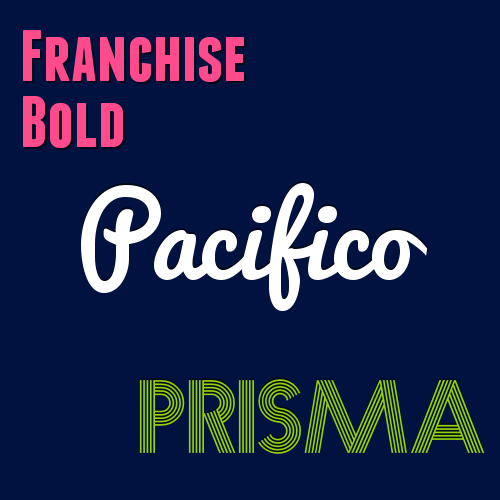

gd-text
=======

Usage example:
```php
<?php
require __DIR__.'/../vendor/autoload.php';

use GDText\Box;

$im = imagecreatetruecolor(500, 500);
$backgroundColor = imagecolorallocate($im, 0, 18, 64);
imagefill($im, 0, 0, $backgroundColor);

$box = new Box($im);
$box->setFontFace(__DIR__.'/Franchise-Bold-hinted.ttf'); // http://www.dafont.com/franchise.font
$box->setFontColor([255, 75, 140]);
$box->setTextShadow([0, 0, 0, 50], 2, 2);
$box->setFontSize(55);
$box->setLeading(0.8);
$box->setBox(20, 20, 460, 460);
$box->setTextAlign('left', 'top');
$box->draw("Franchise\nBold");

$box = new Box($im);
$box->setFontFace(__DIR__.'/Pacifico.ttf'); // http://www.dafont.com/pacifico.font
$box->setFontSize(80);
$box->setFontColor([255, 255, 255]);
$box->setTextShadow([0, 0, 0, 50], 0, -2);
$box->setLeading(0.7);
$box->setBox(20, 20, 460, 460);
$box->setTextAlign('center', 'center');
$box->draw("Pacifico");

$box = new Box($im);
$box->setFontFace(__DIR__.'/Prisma.otf'); // http://www.dafont.com/prisma.font
$box->setFontSize(70);
$box->setFontColor([148, 212, 1]);
$box->setTextShadow([0, 0, 0, 50], 0, -2);
$box->setLeading(0.7);
$box->setBox(20, 20, 460, 460);
$box->setTextAlign('right', 'bottom');
$box->draw("Prisma");

header("Content-type: image/png");
imagepng($im);
```

Example output:


