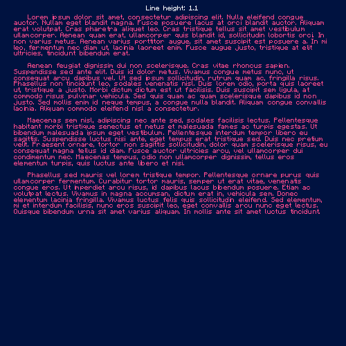
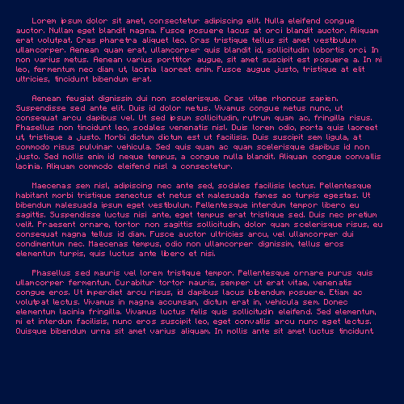
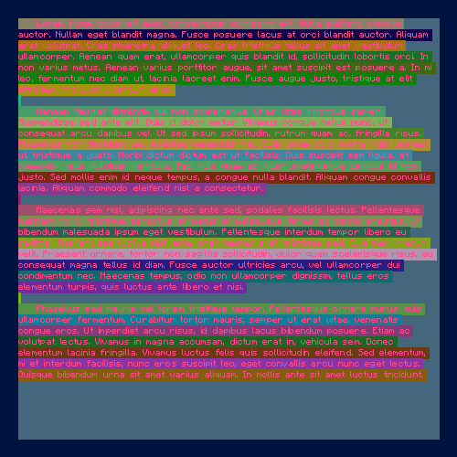

gd-text
=======

###Basic usage example
```php
<?php
require __DIR__.'/../vendor/autoload.php';

use GDText\Box;
use GDText\Color;

$im = imagecreatetruecolor(500, 500);
$backgroundColor = imagecolorallocate($im, 0, 18, 64);
imagefill($im, 0, 0, $backgroundColor);

$box = new Box($im);
$box->setFontFace(__DIR__.'/Franchise-Bold-hinted.ttf'); // http://www.dafont.com/franchise.font
$box->setFontColor(new Color(255, 75, 140));
$box->setTextShadow(new Color(0, 0, 0, 50), 2, 2);
$box->setFontSize(40);
$box->setBox(20, 20, 460, 460);
$box->setTextAlign('left', 'top');
$box->draw("Franchise\nBold");

$box = new Box($im);
$box->setFontFace(__DIR__.'/Pacifico.ttf'); // http://www.dafont.com/pacifico.font
$box->setFontSize(80);
$box->setFontColor(new Color(255, 255, 255));
$box->setTextShadow(new Color(0, 0, 0, 50), 0, -2);
$box->setBox(20, 20, 460, 460);
$box->setTextAlign('center', 'center');
$box->draw("Pacifico");

$box = new Box($im);
$box->setFontFace(__DIR__.'/Prisma.otf'); // http://www.dafont.com/prisma.font
$box->setFontSize(70);
$box->setFontColor(new Color(148, 212, 1));
$box->setTextShadow(new Color(0, 0, 0, 50), 0, -2);
$box->setLeading(0.7);
$box->setBox(20, 20, 460, 460);
$box->setTextAlign('right', 'bottom');
$box->draw("Prisma");

header("Content-type: image/png");
imagepng($im);
```

Example output:


###Multilined text

```php
<?php
require __DIR__.'/../vendor/autoload.php';

use GDText\Box;
use GDText\Color;

$im = imagecreatetruecolor(500, 500);
$backgroundColor = imagecolorallocate($im, 0, 18, 64);
imagefill($im, 0, 0, $backgroundColor);

$box = new Box($im);
$box->setFontFace(__DIR__.'/Minecraftia.ttf'); // http://www.dafont.com/franchise.font
$box->setFontColor(new Color(255, 75, 140));
$box->setTextShadow(new Color(0, 0, 0, 50), 2, 2);
$box->setFontSize(8);
$box->setLineHeight(1.5);
//$box->enableDebug();
$box->setBox(20, 20, 460, 460);
$box->setTextAlign('left', 'top');
$box->draw(
    "    Lorem ipsum dolor sit amet, consectetur adipiscing elit. Nulla eleifend congue auctor. Nullam eget blandit magna. Fusce posuere lacus at orci blandit auctor. Aliquam erat volutpat. Cras pharetra aliquet leo. Cras tristique tellus sit amet vestibulum ullamcorper. Aenean quam erat, ullamcorper quis blandit id, sollicitudin lobortis orci. In non varius metus. Aenean varius porttitor augue, sit amet suscipit est posuere a. In mi leo, fermentum nec diam ut, lacinia laoreet enim. Fusce augue justo, tristique at elit ultricies, tincidunt bibendum erat.\n\n    Aenean feugiat dignissim dui non scelerisque. Cras vitae rhoncus sapien. Suspendisse sed ante elit. Duis id dolor metus. Vivamus congue metus nunc, ut consequat arcu dapibus vel. Ut sed ipsum sollicitudin, rutrum quam ac, fringilla risus. Phasellus non tincidunt leo, sodales venenatis nisl. Duis lorem odio, porta quis laoreet ut, tristique a justo. Morbi dictum dictum est ut facilisis. Duis suscipit sem ligula, at commodo risus pulvinar vehicula. Sed quis quam ac quam scelerisque dapibus id non justo. Sed mollis enim id neque tempus, a congue nulla blandit. Aliquam congue convallis lacinia. Aliquam commodo eleifend nisl a consectetur.\n\n    Maecenas sem nisl, adipiscing nec ante sed, sodales facilisis lectus. Pellentesque habitant morbi tristique senectus et netus et malesuada fames ac turpis egestas. Ut bibendum malesuada ipsum eget vestibulum. Pellentesque interdum tempor libero eu sagittis. Suspendisse luctus nisi ante, eget tempus erat tristique sed. Duis nec pretium velit. Praesent ornare, tortor non sagittis sollicitudin, dolor quam scelerisque risus, eu consequat magna tellus id diam. Fusce auctor ultricies arcu, vel ullamcorper dui condimentum nec. Maecenas tempus, odio non ullamcorper dignissim, tellus eros elementum turpis, quis luctus ante libero et nisi.\n\n    Phasellus sed mauris vel lorem tristique tempor. Pellentesque ornare purus quis ullamcorper fermentum. Curabitur tortor mauris, semper ut erat vitae, venenatis congue eros. Ut imperdiet arcu risus, id dapibus lacus bibendum posuere. Etiam ac volutpat lectus. Vivamus in magna accumsan, dictum erat in, vehicula sem. Donec elementum lacinia fringilla. Vivamus luctus felis quis sollicitudin eleifend. Sed elementum, mi et interdum facilisis, nunc eros suscipit leo, eget convallis arcu nunc eget lectus. Quisque bibendum urna sit amet varius aliquam. In mollis ante sit amet luctus tincidunt."
);

header("Content-type: image/png;");
imagepng($im, null, 9, PNG_ALL_FILTERS);
```



*line height demo*




*text alignment demo*



*debug mode enabled demo*
